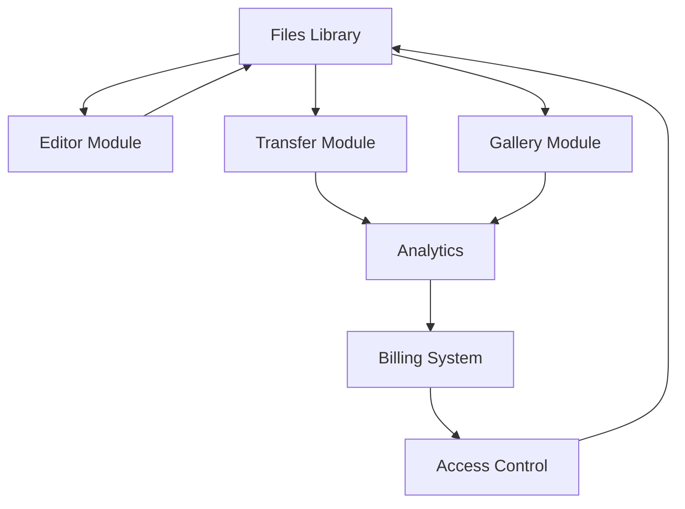

# 📋 PLAN - WrzućFotkę: Unified Platform

## 🎯 **GŁÓWNA KONCEPCJA BIZNESOWA**

### 💍 **CORE: QR Galerie Weselne - Polski Market Leader**

**Główny przypadek użycia:**
1. **Fotograf robi zdjęcia na weselu**
2. **Wrzuca do galerii z kodem QR** 
3. **Goście skanują QR → widzą zdjęcia → pobierają**
4. **Fotograf płaci za 7/14/30 dni dostępu**

### 🚀 **DODATKOWE FEATURES (Upsell opportunities):**
- **Winietki z QR kodem** (dodatkowa opłata)
- **Podstawowe filtry** dla gości 
- **WeTransfer dla fotografów** (bonus feature)
- **AI slideshow** z automatyczną muzyką

### ✅ **DLACZEGO TO GENIALNE:**

#### 🎯 **Market Fit**
- **Konkretny problem**: Goście chcą zdjęcia z wesela NATYCHMIAST
- **Recurring events**: Każde wesele = nowy projekt  
- **Word of mouth**: Zadowoleni goście = nowi klienci fotografowie
- **Local market**: Polski WeTransfer + coś więcej

#### 💰 **Business Benefits**
- **Niższe koszty**: Jeden domain, jeden hosting, jedna baza
- **Proste billing**: Jeden subscription dla wszystkich features
- **Better analytics**: Pełny obraz user journey
- **Easier marketing**: Jedna marka, jeden value proposition

#### 🛠 **Technical Advantages**
- **Shared components**: Reuse UI komponentów
- **Single database**: Relacje między tabelami
- **Unified auth**: Jeden system permissions
- **Easier deployment**: Jeden CI/CD pipeline

---

## 🏗️ **ARCHITEKTURA: Unified Project System**

### **Database Schema - Jedna tabela dla wszystkich typów:**

```sql
-- GŁÓWNA TABELA: projects (nie galleries/transfers osobno)
projects (
  id UUID PRIMARY KEY,
  user_id UUID REFERENCES users(id),
  
  -- Typ projektu określa funkcjonalność
  type ENUM('event_gallery', 'pro_transfer') NOT NULL,
  
  -- Podstawowe info
  title VARCHAR(255) NOT NULL,
  description TEXT,
  
  -- Billing & limits (różne per typ)
  subscription_tier VARCHAR(50), -- 'basic', 'pro', 'premium'
  expires_at TIMESTAMP,
  
  -- Storage & transfer limits
  storage_used BIGINT DEFAULT 0,
  storage_limit BIGINT, -- bytes
  transfer_count INTEGER DEFAULT 0,
  transfer_limit INTEGER,
  
  -- Event Gallery specific
  qr_code VARCHAR(255), -- tylko dla event_gallery
  allow_guest_uploads BOOLEAN DEFAULT false,
  
  -- Pro Transfer specific  
  password_hash VARCHAR(255), -- tylko dla pro_transfer
  download_notifications BOOLEAN DEFAULT true,
  
  -- Shared fields
  is_active BOOLEAN DEFAULT true,
  created_at TIMESTAMP DEFAULT now(),
  updated_at TIMESTAMP DEFAULT now()
);
```

### **Struktura aplikacji - Shared UI, Different Logic:**

```
app/
├── dashboard/
│   ├── projects/       # � Unified project management
│   │   ├── create/     # Wybór: Event Gallery vs Pro Transfer
│   │   ├── [id]/       # Projekt details (adaptive UI)
│   │   └── list/       # Lista wszystkich projektów
│   ├── editor/         # 🎨 Photo Editor (unchanged)
│   └── settings/       # ⚙️ Subscriptions per type
├── e/[projectId]/      # � Event Gallery public page
├── t/[projectId]/      # 📤 Transfer download page  
└── api/
    ├── projects/       # CRUD operations
    ├── uploads/        # File handling (shared)
    └── downloads/      # Download logic (shared)
```

---

## 📊 **FEATURE MATRIX & USER FLOW**

### **🎯 PLANY CENOWE - Event-Based Model:**

| Plan | Cena za EVENT | Storage | Czas dostępu | QR Gallery | Winietki | Dodatkowe | Główny use case |
|------|---------------|---------|--------------|------------|----------|-----------|-----------------|
| **[T] Darmowy** | **0 zł** | - | - | ❌ | ❌ | Transfer 100MB | Test platformy |
| **[G] Wesele Basic** | **250 zł** | **10GB** | **7 dni** | ✅ **QR Gallery** | ✅ **Winietka A5** | 5 transferów (500MB) | Małe wesela (50-100 gości) |
| **[G] Wesele Pro** | **350 zł** | **15GB** | **14 dni** | ✅ **QR + Custom URL** | ✅ **Winietki + AI design** | 15 transferów (2GB) + filtry | Średnie wesela (100-200 gości) |  
| **[G] Studio Premium** | **450 zł** | **20GB** | **30 dni** | ✅ **Unlimited QR galleries** | ✅ **AI slideshow + video** | Unlimited transfery (5GB) | Duże eventy + studia |

### 💡 **Kluczowe Value Propositions:**

#### 💑 **Dla Pary Młodej / Organizatorów:**
```
1. Zbierz WSZYSTKIE zdjęcia od gości w jednym miejscu
2. Wygeneruj QR kod → Postaw na stołach
3. Goście wrzucają swoje zdjęcia + pobierają inne  
4. Masz kompletną dokumentację eventu!
```

#### 📸 **Dla Fotografów (opcjonalnie):**
```
1. Wrzuć profesjonalne zdjęcia  
2. Goście pobierają natychmiast
3. Brak mailowania setek plików
4. Dodatkowa wartość dla klienta
```

#### � **Dla Gości:**
```
1. Zeskanuj QR → Zobacz wszystkie fotki
2. Wrzuć swoje zdjęcia z telefonu
3. Pobierz zdjęcia innych gości  
4. Zastosuj filtry (Pro plan)
```

#### 💼 **Dla Profesjonalistów (WeTransfer):**
```
Osobny zakup - wysyłanie dużych plików
- RAW files, projekty, materiały firmowe
- Bez limitu czasu (nie event-based)  
- Focus na business use cases
```

### 🚀 **Oddzielne Revenue Streams:**

#### 🎉 **EVENT GALLERIES (Per-project pricing)**
**Target**: Para młoda, organizatorzy eventów, solenizanci
```
Typ: 'event_gallery'
Basic (250zł): 10GB, 7 dni, QR gallery + winietka
Pro (350zł): 15GB, 14 dni, AI features + filtry dla gości  
Premium (450zł): 20GB, 30 dni, AI slideshow + unlimited features

Jeden projekt = jedno wydarzenie = jednorazowa płatność
```

#### 📤 **PROFESSIONAL TRANSFERS (Subscription model)**  
**Target**: Firmy, freelancerzy, agencje, projektanci
```
Typ: 'pro_transfer' 
Transfer Basic (50zł/miesiąc): 50GB storage, 200GB transfer/miesiąc
Transfer Pro (120zł/miesiąc): 200GB storage, 1TB transfer/miesiąc  
Transfer Business (250zł/miesiąc): 1TB storage, unlimited transfer

Dostęp miesięczny/roczny + możliwość tworzenia wielu projektów transfer
```

### 🔄 **Jak to działa w praktyce:**

#### **Event Gallery User:**
```typescript
// Tworzy projekt event
const project = {
  type: 'event_gallery',
  title: 'Wesele Anna & Paweł',
  subscription_tier: 'pro', // 350zł
  expires_at: new Date(+7 days),
  storage_limit: 15 * 1024^3, // 15GB
  qr_code: 'generated-qr-code',
  allow_guest_uploads: true
}
```

#### **Professional Transfer User:**
```typescript
// Ma subscription na Transfer Pro
const subscription = {
  type: 'pro_transfer',
  tier: 'pro', // 120zł/miesiąc
  storage_limit: 200 * 1024^3, // 200GB
  monthly_transfer_limit: 1024^4, // 1TB
  expires_at: new Date(+30 days)
}

// Może tworzyć wiele projektów transfer w ramach subskrypcji
const transferProject = {
  type: 'pro_transfer', 
  title: 'Projekty dla klienta XYZ',
  parent_subscription: subscription.id
}
```

### **User Journey Examples:**

#### � **Para Młoda Workflow (Główny use case):**
```
1. Tworzy event "Nasze Wesele" 
2. Płaci plan (250/350/450zł)
3. Generuje QR kod + drukuje winietki
4. Stawia na stołach: "Wrzuć swoje zdjęcia!"
5. Goście wrzucają + pobierają fotki innych
6. Para ma kompletną dokumentację wesela
7. Dostęp przez 7/14/30 dni (w zależności od planu)
```

#### 👥 **Guest Experience (Upload + Download):**
```
1. Skanuje QR → Otwiera gallery eventu
2. Widzi już wrzucone zdjęcia (fotograf + inni goście)
3. WRZUCA swoje zdjęcia z telefonu
4. Pobiera zdjęcia innych gości 
5. Aplikuje podstawowe filtry (Pro+)
6. Ma dostęp przez cały okres eventu
```

#### 📸 **Fotograf jako "Dostawca treści":**
```
1. Para młoda tworzy event
2. Dodaje fotografa jako "contributora" 
3. Fotograf wrzuca profesjonalne zdjęcia
4. Goście widzą pro fotki + swoje amatorskie
5. Win-win: fotograf = dodatkowa wartość
```

#### 💼 **Business Professional (Osobny produkt):**
```
1. Kupuje Transfer subscription (50-300zł/mies)
2. Wysyła duże pliki klientom/zespołowi  
3. Analytics, security, branding
4. Nie event-based, tylko business workflow
```
```
1. Tworzy event "Wesele Anna & Paweł"
2. Wybiera plan (250/350/450zł)  
3. Wrzuca zdjęcia z wesela
4. Generuje QR kod + winietki
5. Drukuje i stawia na stołach
6. Goście skanują i pobierają
7. Analytics: kto ile pobrał
```

#### � **Wedding Guest Experience:**
```
1. Skanuje QR kod z winietki na stole
2. Otwiera gallery "Wesele Anna & Paweł" 
3. Przegląda wszystkie zdjęcia
4. Oznacza swoje ulubione
5. Pobiera zdjęcia ze sobą
6. (Pro) Aplikuje podstawowe filtry
```

#### 🔄 **WeTransfer Use Case (Bonus):**
```  
1. Fotograf ma już konto
2. Potrzebuje wysłać RAW files do klienta
3. Używa wbudowanego transfer systemu
4. Nie musi płacić za osobny WeTransfer Pro
```

---

## 🎯 **IMPLEMENTATION STATUS & ROADMAP**

### **✅ PHASE 1: Landing Page & Product Switching (COMPLETED)**
**Goal:** Dynamic landing page supporting both product lines

#### ✅ Completed Tasks:
- [x] **ProductContext Implementation**
  - React Context API for shared state management
  - Global product switching between 'gallery' and 'transfer'
  - State persistence across all landing page sections
  
- [x] **Hero Section Dynamic Content**
  ```typescript
  // Dual product tabs with dynamic content
  /components/hero/Hero.tsx
  - Product selection tabs (Gallery vs Transfer)
  - Dynamic headlines, descriptions, features, stats
  - CTA buttons adapted per product type
  ```

- [x] **Features Section Adaptation**
  ```typescript
  /components/hero/Features.tsx
  - galleryFeatures: QR codes, photo editing, poster creation
  - transferFeatures: Large files, security, analytics
  - Dynamic switching based on activeProduct
  ```

- [x] **Pricing Section Dual Plans**
  ```typescript
  /components/hero/Pricing.tsx
  - galleryPlans: Event-based pricing (250-450zł per event)
  - transferPlans: Monthly subscriptions (50-250zł/month)
  - Dynamic plan display with product-specific features
  ```

- [x] **How It Works Workflows**
  ```typescript
  /components/hero/HowItWorks.tsx
  - gallerySteps: 5-step wedding photo collection workflow
  - transferSteps: 4-step professional file sharing workflow
  - Dynamic content and step visualization
  ```

- [x] **QR-Specific Content Conditional Display**
  ```typescript
  /components/hero/HowQRWorks.tsx
  - Shows only for gallery product (wedding-specific)
  - Hides when transfer product is selected
  ```

**✅ Deliverable:** Fully dynamic landing page ready for both business lines

---

### **🔄 PHASE 2: Backend Architecture (IN PROGRESS)**
**Goal:** Prepare unified database and API structure

#### Tasks:
- [ ] **Supabase Setup**
  - Storage buckets configuration
  - Database schema creation (unified projects table)
  - RLS policies setup
  
- [ ] **API Routes Foundation**
  ```
  /api/
  ├── projects/       # CRUD for both gallery and transfer projects
  ├── uploads/        # File handling (shared)
  ├── downloads/      # Download logic (shared)
  └── billing/        # Subscription management
  ```

- [ ] **Shared Components Library**
  - Navigation component expansion
  - File upload components
  - Modal systems
  - Progress indicators

**Deliverable:** Working dashboard structure z enhanced navigation

---

### **PHASE 2: File Management Core (Week 2)**
**Goal:** Central file storage system that feeds all modules

#### Tasks:
- [ ] **File Upload System**
  ```typescript
  // Universal file upload dla wszystkich modułów
  /dashboard/files/upload
  - Drag & drop multiple files
  - Progress tracking
  - Automatic categorization
  - Metadata extraction
  ```

- [ ] **File Library Interface**
  ```typescript
  /dashboard/files/library
  - Grid/list view toggle
  - Search & filtering
  - Bulk selection
  - Quick actions (edit/share/delete)
  ```

- [ ] **Integration Points**
  - Editor can pull from library
  - Transfers can select from library  
  - Galleries can organize library files

**Deliverable:** Working file management system

---

### **PHASE 3: Enhanced Editor Integration (Week 2-3)**
**Goal:** Editor becomes part of larger workflow

#### Tasks:
- [ ] **Editor Enhancements**
  ```typescript
  New features w editor:
  - "Save to Library" button
  - "Create Gallery" from edited images
  - "Send Transfer" quick action
  - Version history (original vs edited)
  ```

- [ ] **Workflow Integration**
  ```
  Editor → Files → Transfers/Galleries
  Smooth transitions między modułami
  State preservation podczas nawigacji
  ```

**Deliverable:** Editor zintegrowany z file system

---

### **PHASE 4: Transfer System (Week 3-4)**
**Goal:** WeTransfer clone integrated z file library

#### Tasks:
- [ ] **Transfer Creation Flow**
  ```typescript
  /dashboard/transfers/create
  - Select files from library lub upload new
  - Recipient management
  - Security settings (password, expiry)
  - Custom messaging
  ```

- [ ] **Public Transfer Pages**
  ```typescript
  /t/[transferId]
  - Clean download interface
  - No registration required
  - Mobile optimized
  - Download analytics tracking
  ```

- [ ] **Transfer Management**
  ```typescript
  /dashboard/transfers/
  - Active transfers list
  - Download statistics
  - Extend/modify transfers
  - Resend notifications
  ```

**Deliverable:** Full transfer system

---

### **🎯 PHASE 3: Dashboard Restructure (NEXT PRIORITY)**
**Goal:** Unified project management interface

#### Tasks:
- [ ] **Dashboard Navigation Update**
  ```typescript
  /dashboard/
  ├── page.tsx          # Overview with both project types
  ├── projects/
  │   ├── create/       # Project type selection
  │   ├── [id]/         # Unified project details
  │   └── list/         # All projects with filtering
  ├── editor/           # (existing, enhanced)
  └── settings/         # Subscription management
  ```

- [ ] **Project Creation Flow**
  ```typescript
  // Step 1: Choose project type
  'event_gallery' | 'pro_transfer'
  
  // Step 2: Project configuration per type
  // Gallery: Event details, QR settings, duration
  // Transfer: Security, expiry, file limits
  ```

**Deliverable:** Unified project management system

---

### **🎨 PHASE 4: Gallery System Implementation**
**Goal:** Wedding/event gallery functionality

#### Tasks:
- [ ] **QR Code Generation**
  ```typescript
  /dashboard/projects/[id]/qr
  - Generate unique QR codes per gallery
  - Poster/business card template creation
  - Print-ready PDF export
  ```

- [ ] **Public Gallery Experience** 
  ```typescript
  /e/[projectId]  # Event gallery public page
  - Guest photo upload interface
  - Photo browsing and download
  - Basic filtering and favorites
  - Mobile-optimized UI
  ```

- [ ] **Gallery Management**
  ```typescript
  /dashboard/projects/[id]/manage
  - Guest upload moderation
  - Photo organization and albums
  - Access control and permissions
  - Analytics and download stats
  ```

**Deliverable:** Complete wedding gallery system

---

### **📤 PHASE 5: Transfer System Implementation** 
**Goal:** Professional file sharing functionality

#### Tasks:
- [ ] **Transfer Creation Interface**
  ```typescript
  /dashboard/projects/[id]/upload
  - Large file upload (up to 50GB)
  - Progress tracking and resumable uploads
  - Batch file selection and management
  ```

- [ ] **Transfer Sharing & Security**
  ```typescript
  /t/[projectId]  # Transfer download page
  - Password protection option
  - Download expiry settings
  - Download count limitations
  - Access logging and notifications
  ```

- [ ] **Professional Features**
  ```typescript
  - Email notifications for downloaders
  - Branded download pages
  - Download analytics and reporting
  - API access for enterprise users
  ```

**Deliverable:** Professional file transfer system

---

### **📊 PHASE 6: Analytics & Business Intelligence**
**Goal:** Data insights and usage monitoring

#### Tasks:
- [ ] **Unified Analytics Dashboard**
  ```typescript
  /dashboard/analytics/
  - Project performance metrics
  - Storage usage across projects
  - User engagement patterns
  - Revenue tracking per project type
  ```

- [ ] **Project-Specific Analytics**
  ```typescript
  Gallery Projects:
  - Guest upload statistics
  - Photo download patterns  
  - QR code scan analytics
  - Event engagement timeline
  
  Transfer Projects:
  - Download completion rates
  - Access location tracking
  - File popularity metrics
  - Security event logging
  ```

**Deliverable:** Comprehensive analytics system

---

### **💳 PHASE 7: Billing & Subscription System**
**Goal:** Revenue generation through dual pricing models

#### Tasks:
- [ ] **Dual Pricing Implementation**
  ```typescript
  Gallery Projects (Event-based):
  - Basic (250zł): 10GB, 7 days, basic QR
  - Pro (350zł): 15GB, 14 days, custom templates  
  - Premium (450zł): 25GB, 30 days, AI features
  
  Transfer Projects (Monthly subscription):  
  - Starter (50zł/month): 5GB transfers
  - Business (150zł/month): 20GB + analytics
  - Enterprise (250zł/month): 50GB + API access
  ```

- [ ] **Payment Integration**
  ```typescript
  - Stripe/PayU integration
  - One-time payments for gallery projects
  - Recurring billing for transfer subscriptions
  - Usage monitoring and enforcement
  - Automatic project cleanup after expiry
  ```

**Deliverable:** Complete monetization system

---

### **🚀 PHASE 8: Polish & Advanced Features** 
**Goal:** Production-ready platform with professional features

#### Tasks:
- [ ] **Mobile PWA Enhancement**
  - Offline support for photo viewing
  - Native-like upload experience
  - Push notifications for project updates

- [ ] **Team Collaboration Features**
  - Multi-user project access
  - Role-based permissions
  - Activity logging and notifications

- [ ] **White-label Options (Enterprise)**
  - Custom branding for transfer pages
  - Domain customization
  - API access for integrations

**Deliverable:** Enterprise-ready platform

---

### **PHASE 8: Advanced Features & Polish (Week 7-8)**
**Goal:** Professional-grade features

#### Tasks:
- [ ] **Team Collaboration** (Studio tier)
- [ ] **White-label Options**
- [ ] **Mobile PWA**
- [ ] **Performance Optimization**

**Deliverable:** Production-ready platform

---

## ⚡ **CURRENT STATUS SUMMARY**

### **🎉 WHAT'S WORKING NOW:**
- ✅ **Dynamic Landing Page**: Complete product switching between Gallery and Transfer
- ✅ **Product Context**: Global state management across all components  
- ✅ **Responsive Design**: Mobile-optimized hero, features, pricing, and workflow sections
- ✅ **Dual Content Strategy**: Wedding-focused vs Business-focused messaging
- ✅ **Existing Photo Editor**: Working editor with filters and poster creation

### **🎯 IMMEDIATE PRIORITIES (Next 1-2 weeks):**

1. **Backend Setup** (Critical Path)
   ```bash
   # Database schema implementation
   supabase gen types typescript --schema public > types/database.types.ts
   
   # Storage buckets configuration
   - gallery_images bucket
   - transfer_files bucket  
   - generated_assets bucket (QR codes, posters)
   ```

2. **Dashboard Restructure**
   ```typescript
   // Convert existing dashboard to project-based system
   /dashboard/page.tsx -> Project overview with dual tabs
   /dashboard/projects/create -> Project type selection
   /dashboard/projects/[id] -> Unified project management
   ```

3. **Authentication Enhancement**
   ```typescript
   // User profiles with project preferences
   interface UserProfile {
     preferred_product: 'gallery' | 'transfer' | null
     subscription_tier: string
     project_count: number
   }
   ```

### **🚧 TECHNICAL DEBT & IMPROVEMENTS:**
- [ ] **Editor Integration**: Connect existing editor to new project system
- [ ] **Navigation Consistency**: Update sidebar to reflect new structure  
- [ ] **SEO Optimization**: Dynamic meta tags based on selected product
- [ ] **Performance**: Lazy loading for product-specific components

### **📋 DEFINITION OF DONE - Phase 2:**
- [ ] Users can create both gallery and transfer projects
- [ ] Project dashboard shows unified view of all project types
- [ ] Basic file upload works for both project types
- [ ] Payment integration ready for both pricing models
- [ ] Public pages accessible via /e/[id] and /t/[id] routes

---

## 🔗 **MODULE INTERCONNECTIONS**

### **Data Flow Between Modules:**



### **Shared State Management:**
```typescript
// Global state dla całej aplikacji
interface AppState {
  user: UserProfile
  subscription: SubscriptionTier
  files: FileLibrary
  currentProject: Project | null
  notifications: Notification[]
}
```

---

## 🎨 **UI/UX CONSISTENCY**

### **Design System Expansion:**
```typescript
// Existing + New components
components/
├── editor/        # Existing - enhanced
├── common/        # Shared across modules
│   ├── FileUpload/
│   ├── FileGrid/
│   ├── ProgressBar/
│   └── ShareModal/
├── transfers/     # New module
├── galleries/     # New module
└── analytics/     # New module
```

### **Navigation Enhancement:**
```typescript
// Unified sidebar navigation
const navigation = [
  { name: 'Dashboard', href: '/dashboard', icon: HomeIcon },
  { name: 'Editor', href: '/dashboard/editor', icon: PhotoIcon },
  { name: 'My Files', href: '/dashboard/files', icon: FolderIcon },
  { name: 'Transfers', href: '/dashboard/transfers', icon: ArrowUpTrayIcon },
  { name: 'Galleries', href: '/dashboard/galleries', icon: ViewColumnsIcon },
  { name: 'Analytics', href: '/dashboard/analytics', icon: ChartBarIcon },
]
```

---

## 🚀 **UPDATED DEVELOPMENT STRATEGY**

### **✅ Completed (October 2024):**
- **Landing Page Transformation**: Dynamic product switching implemented
- **UI/UX Foundation**: Dual-product design system established  
- **Content Strategy**: Wedding vs Business messaging defined
- **Technical Architecture**: React Context API for state management

### **🎯 Current Development Timeline:**

**Week 1-2 (November 2024): Backend Foundation**
- Supabase schema deployment
- Project CRUD API implementation  
- File upload infrastructure
- Authentication enhancement

**Week 3-4 (November 2024): Dashboard Rebuild** 
- Project management interface
- Unified creation flows
- Gallery and transfer basic functionality
- Editor integration with projects

**Week 5-6 (December 2024): Core Features**
- QR code generation for galleries
- Public gallery and transfer pages
- Basic analytics implementation
- Payment integration setup

**Week 7-8 (December 2024): Beta Launch**
- Security and performance optimization
- Mobile PWA enhancements  
- User testing and feedback collection
- Marketing material preparation

### **🧪 Testing Strategy (Updated):**
- **Phase 2**: Internal testing with existing editor users
- **Phase 3**: Beta testing with select photographers (gallery focus)
- **Phase 4**: Business user testing (transfer focus)  
- **Launch**: Full public launch with both product lines

### **⚠️ Risk Mitigation (Updated):**
- **Backward Compatibility**: Existing editor users unaffected during transition
- **Feature Flags**: Gradual rollout per user segment
- **Dual Landing Pages**: Can maintain separate pages if needed during transition
- **Data Migration**: Careful migration of existing user data to new project system

---

## 💡 **CONCLUSION: Dlaczego Jedna Aplikacja**

### ✅ **Zalety unified approach:**
- **User retention**: Wszystko w jednym miejscu
- **Cross-selling**: Łatwiejsze przekonanie do upgrade
- **Development efficiency**: Shared components i infrastructure  
- **Branding**: Jedna silna marka vs dwie słabsze
- **Data insights**: Pełny user journey analytics
- **Cost optimization**: Jeden hosting, jedna domena, jedna baza

### 🎯 **Success Metrics:**
- **MAU**: Monthly Active Users across all modules
- **Feature adoption**: % users używających >1 modułu
- **Subscription conversion**: Free → Paid conversion rate
- **User retention**: 30/60/90 day retention rates

---

**🚀 READY TO BUILD: Unified WrzućFotkę Platform!**

Jedna aplikacja = lepszy UX + niższe koszty + łatwiejszy development + silniejsza marka!